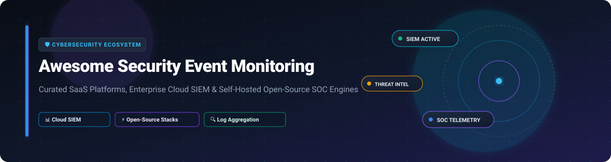

# 🛡️ Awesome Security Event Monitoring

  
  
  
  

> 🚀 **Curated Directory of Cloud SIEM Platforms, Log Aggregators, Threat Detection Engines & Self-Hosted Security Operations Center (SOC) Tools.**

---

## 📌 Table of Contents

- [📊 Sector Overview & Market Intelligence](#-sector-overview--market-intelligence)
- [☁️ SaaS & Commercial SIEM Platforms](#️-saas--commercial-siem-platforms)
- [⚡ Open-Source GitHub Security Projects](#-open-source-github-security-projects)
  - [🛡️ Enterprise Open-Source SIEM & SOAR](#️-enterprise-open-source-siem--soar)
  - [📦 Log Aggregation, Parsing & Network Monitoring](#-log-aggregation-parsing--network-monitoring)
  - [🔬 Detection Engineering & Threat Hunting](#-detection-engineering--threat-hunting)
  - [🪶 Lightweight & Self-Hosted HomeLab SIEMs](#-lightweight--self-hosted-homelab-siems)
- [🤝 How to Contribute](#-how-to-contribute)
- [⚠️ Enterprise Disclaimer](#️-enterprise-disclaimer)
- [📈 Star History](#-star-history)
- [💖 Support & Community](#-support--community)

---

## 📊 Sector Overview & Market Intelligence

The global **Security Information and Event Management (SIEM)** and Security Event Monitoring market size was valued at **~$6.2 Billion in 2024** and is projected to reach **~$12.8 Billion by 2030**, expanding at a CAGR of **~12.5%**. 

The sector is **moderately fragmented with ongoing consolidation**. Major cloud hyperscalers (*Microsoft Sentinel*) and unified observability leaders (*Datadog*, *Splunk/Cisco*) are capturing massive enterprise market share by bundling log management with cloud security. Simultaneously, specialized UEBA and AI-native vendors (*Exabeam*, *Securonix*, *Rapid7*) hold critical enterprise niches, while a vibrant **open-source ecosystem** (*Wazuh*, *CrowdSec*, *OpenSearch*) powers self-hosted SOCs and air-gapped environments.

---

## ☁️ SaaS & Commercial SIEM Platforms

The following table summarizes enterprise SaaS platforms providing managed SIEM, cloud telemetry aggregation, User and Entity Behavior Analytics (UEBA), and automated incident response (SOAR). 

*Table is sorted by **Company Size / Valuation (Descending)**.*

| Product / Platform 🏢 | Description 📝 | Specific Pricing 💵 | Free Tier / Free Trial Limit 🎁 | Company Size (Rev / Valuation) 📈 |
| :--- | :--- | :--- | :--- | :--- |
| **[Microsoft Sentinel](https://azure.microsoft.com/en-us/products/microsoft-sentinel)** | Cloud-native SIEM and SOAR platform deeply integrated with Azure, M365, and AI Security Copilot. | **$2.46 per GB** ingested (Pay-as-you-go) or **$100/day** commitment for 100 GB/day ($1.72/GB). | **31-Day Free Trial** (First 10 GB/day ingested free for 31 days). | **~$3.1 Trillion Market Cap** ($245B+ Annual Rev) |
| **[Salesforce Shield Event Monitoring](https://www.salesforce.com/)** | Native event logging and auditing tracks real-time API calls, login history, and data downloads in Salesforce. | **10% of net purchase total** of covered Salesforce products (or ~$15–$30/user/month). | **Free Developer Edition** (Access up to 24 hours of event logs). | **~$280 Billion Market Cap** ($38B+ Annual Rev) |
| **[Datadog Cloud SIEM](https://www.datadoghq.com/)** | Unified security and observability platform combining log analytics, real-time threat detection, and posture management. | **$0.10 per GB** analyzed/day + **$0.20 per GB** indexed/month. | **14-Day Free Trial** (Full featured, unlimited log volume during trial). | **~$42 Billion Market Cap** ($2.6B+ Annual Rev) |
| **[Splunk Cloud](https://www.splunk.com/)** | The enterprise SIEM standard with advanced SPL querying, automated correlation engines, and massive integration app ecosystem. | **$1,800/year** per Workload Unit (WCU) or ~$0.15 per GB indexer rate. | **14-Day Free Trial** (Splunk Cloud, up to 5 GB/day) or **60-Day Trial** (Splunk Enterprise). | **$28 Billion Acquisition** ($4.2B+ Annual Rev via Cisco) |
| **[Elastic Security](https://www.elastic.co/security)** | SIEM and EDR suite built on the Elastic Stack featuring pre-built Sigma rules, timelines, and anomaly detection. | **$95/month** starting Cloud Standard tier (or ~$0.10/GB cloud ingestion). | **14-Day Free Trial** (Elastic Cloud) / **Free Self-Managed Standard Tier** forever. | **~$8.5 Billion Market Cap** ($1.3B+ Annual Rev) |
| **[Rapid7 InsightIDR](https://www.rapid7.com/products/insightidr/)** | Cloud SIEM integrating UEBA, endpoint detection, threat intelligence feeds, and deception honeypots. | **$1,250/month** (Billed annually for up to 500 endpoints / ~$2.50/asset/month). | **30-Day Free Trial** (Full features, unlimited endpoint log ingestion). | **~$2.3 Billion Market Cap** ($800M+ Annual Rev) |
| **[Sumo Logic Cloud SIEM](https://www.sumologic.com/)** | Cloud-native log management and automated Insight correlation engine for cloud infrastructure telemetry. | **$210/month** Essentials tier (Includes 3 GB/day log ingestion and retention). | **30-Day Free Trial** (1 GB/day ingestion, 4 GB storage, up to 20 users). | **~$1.7 Billion Valuation** ($300M+ Annual Rev) |
| **[Exabeam](https://www.exabeam.com/)** | Behavioral AI-driven SIEM platform generating automated incident timelines and threat detection baselines. | **$1,500/month** base subscription (Scales with active user count and volume). | **30-Day Sandbox Trial** (Interactive cloud environment upon request). | **~$1.2 Billion Valuation** ($150M+ Annual Rev) |
| **[Securonix](https://www.securonix.com/)** | Cloud-native Next-Gen SIEM combining UEBA, SOAR, and Network Detection & Response (NDR). | **$1,000/month** base tier (Calculated per active endpoint or EPS throughput). | **30-Day Cloud Trial** (Guided POC environment). | **~$1.2 Billion Valuation** ($110M+ Annual Rev) |
| **[LogRhythm](https://logrhythm.com/)** | Mid-market SIEM platform providing centralized log management, automated threat lifecycle management, and SOAR. | **$1,200/month** starting deployment package for enterprise log management. | **30-Day Virtual Proof of Concept** (Hosted sandbox environment). | **~$1.0 Billion Valuation** ($120M+ Annual Rev) |

---

## ⚡ Open-Source GitHub Security Projects

Open-source tools are foundational to modern Security Operations Centers (SOCs). Below is a curated list of open-source SIEM platforms, log collectors, threat detection frameworks, and network security monitors.

*List is sorted by **GitHub Stars_Count (Descending)**.*

### 🛡️ Enterprise Open-Source SIEM & SOAR

- **[Wazuh](https://github.com/wazuh/wazuh)**   
  **The premier open-source SIEM platform** (GPLv2). Features endpoint monitoring, vulnerability assessment, regulatory compliance auditing (PCI-DSS, NIST, HIPAA), and automatic threat response. Wazuh integrates an OpenSearch-based indexer, server analysis engine, and multi-platform agents.

- **[CrowdSec](https://github.com/crowdsecurity/crowdsec)**   
  **Open-source collaborative security engine** (MIT). Parses log files from web servers, SSH, and firewalls to detect attacks, leveraging a crowd-sourced threat intelligence network to block hostile IPs automatically.

- **[Graylog](https://github.com/Graylog2/graylog2-server)**   
  **Centralized log management & analytical UI** (SSPL). Offers fast log ingestion, alerting rules, customizable dashboards, and an experimental Model Context Protocol (MCP) endpoint for LLM/AI security integrations.

- **[Security Onion](https://github.com/Security-Onion-Solutions/security-onion)**   
  **Free and open Linux distribution for threat hunting and SOC monitoring**. Combines Suricata, Zeek, Elastic/OpenSearch, and CyberChef into an enterprise-ready security platform.

- **[Shuffle SOAR](https://github.com/Shuffle/Shuffle)**   
  **Open-source Security Orchestration, Automation, and Response (SOAR)** framework (Apache-2.0). Connects SIEM alerts with threat intelligence APIs and automated response workflows via OpenAPI.

- **[Sentora](https://github.com/d3vhex/Sentora)**   
  **AI-powered self-hosted SIEM, EDR, and SOAR platform**. Built with strict air-gap support, local threat feed ingestion (AlienVault OTX, VirusTotal, abuse.ch), and automated regex agent verification.

---

### 📦 Log Aggregation, Parsing & Network Monitoring

- **[OpenSearch Security Analytics](https://github.com/opensearch-project/OpenSearch)**   
  **Open-source search & security analytics suite** (Apache-2.0). Provides built-in security detection rules, correlation visualizers, and threat intelligence mapping.

- **[Fluentd](https://github.com/fluent/fluentd)**   
  **Unified logging layer** (Apache-2.0). Collects and unifies log data across application stacks with 500+ plugins before routing telemetry to SIEM storage backends.

- **[Fluent Bit](https://github.com/fluent/fluent-bit)**   
  **Lightweight log processor & forwarder** (Apache-2.0). Designed for high-performance log collection in Kubernetes, cloud, and embedded environments (~4MB binary footprint).

- **[Zeek (formerly Bro)](https://github.com/zeek/zeek)**   
  **Enterprise network security monitoring framework** (BSD). Translates raw network packet traffic into structured, queryable security event logs for threat analysis.

- **[Arkime (formerly Moloch)](https://github.com/arkime/arkime)**   
  **Large-scale full packet capture (PCAP) & indexing system** (Apache-2.0). Provides intuitive web interfaces for browsing, searching, and exporting network telemetry.

- **[Suricata](https://github.com/OISF/suricata)**   
  **High-performance Network IDS, IPS, and Network Security Monitoring engine** (GPLv2). Performs deep packet inspection and outputs standard EVE JSON security events.

- **[syslog-ng](https://github.com/syslog-ng/syslog-ng)**   
  **High-throughput log management daemon** (GPL/LGPL). Collects, parses, enriches, and archives system logs across enterprise networks in real-time.

---

### 🔬 Detection Engineering & Threat Hunting

- **[Sigma Rules](https://github.com/SigmaHQ/sigma)**   
  **Generic signature format for SIEM detection rules** (MIT). Enables detection engineers to write rules once and convert them for Splunk, Elastic, Sentinel, QRadar, or Wazuh.

- **[ELK Security Stack](https://github.com/cyberdesserts/elk_stack)**   
  **Pre-configured Elasticsearch, Logstash, and Kibana docker setup** tailored for security event monitoring across Linux, Windows, and macOS endpoints.

---

### 🪶 Lightweight & Self-Hosted HomeLab SIEMs

- **[Security Shallots](https://pypi.org/project/security-shallots/)**  
  **Adaptive self-hosted SIEM for low-resource environments**. Ingests telemetry from Suricata, Syslog, pfSense, Wazuh, and CrowdSec. Auto-scales from Raspberry Pi (~200MB RAM) to full server deployments with scikit-learn anomaly baselines.

- **[CNSL (Correlated Network Security Layer)](https://pypi.org/project/cnsl/)**  
  **Network security monitoring with ML anomaly detection**. Features authentication monitoring, tcpdump captures, GeoIP enrichment, SQLite persistence, and iptables automated blocking.

---

## 🤝 How to Contribute

Contributions are welcome! Follow these steps to submit additions or updates:

1. **Fork the repository** on GitHub.
2. Edit `README.md` to add or update your tool listing under the appropriate category.
3. Ensure all links are active, descriptions are factual, and specific pricing/star metrics follow the repo standard.
4. Submit a **Pull Request** with a brief summary of changes.

---

## ⚠️ Enterprise Disclaimer

- This repository is a **community-curated directory** created for research and education.
- **Data Privacy & Compliance**: Processing security log telemetry requires compliance with GDPR, HIPAA, and SOC2 standards. Ensure appropriate data scrubbing and retention controls.
- **Total Cost of Ownership (TCO)**: Open-source SIEM platforms eliminate license fees but require dedicated engineering maintenance, custom rule tuning, and infrastructure management.

---

## 📈 Star History

---

## 💖 Support & Community

Thank you for visiting **Awesome Security Event Monitoring**! If this repository provides value to your SOC team, security research, or homelab infrastructure, please consider supporting the project:

- ⭐ **Star this repository** to increase visibility within the security community!
- 🔀 **Fork & Contribute** by submitting updates for emerging tools and SIEM platforms.
- 📢 **Share** with your cybersecurity colleagues, SOC analysts, and DevOps teams.

  

